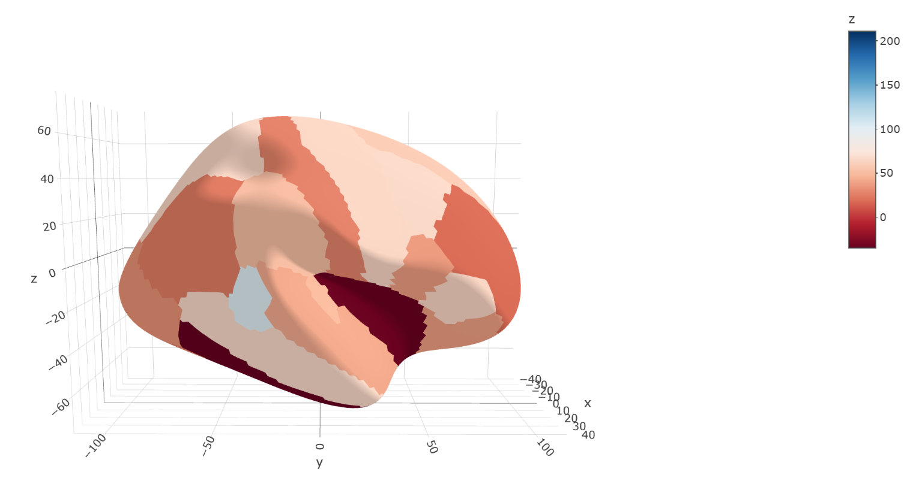
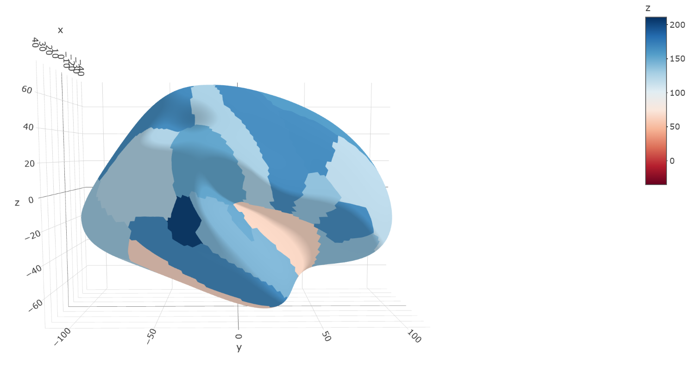

# Creating Consistent Color Scales Across Multiple 3D Brain Plots in R

This script demonstrates how to create and visualize brain regions with consistent color scales across multiple brain plots. It utilizes the *ggseg3d* package for 3D brain visualization and ensures that all plots use the same color scale for comparative purposes.


## Key Features:

1. Global Color Scale: Ensure that all brain plots use the same color scale based on the global minimum and maximum values, ensuring consistency across plots.

2. Visualize Longitudinal Changes: Use the same color scale to compare brain regions at different time points or conditions, allowing for consistent visual comparison.

3. Group-Level Comparisons: Facilitate the comparison of brain regions across different groups by using a common color scale, making group-level differences more apparent.

## Prerequisites

To run this script, you need the following R libraries:

1. RColorBrewer: For color palettes.
2. ggseg3d: For creating interactive 3D brain plots.
3. htmlwidgets: For saving the interactive 3D brain plots as HTML files.


You can install them using the following commands:

```r
install.packages("RColorBrewer")
install.packages("ggseg3d")
install.packages("htmlwidgets")
```

## Usage

### 1. Load Required Libraries
Load the necessary libraries to create and save 3D brain plots:

```r
library(RColorBrewer)    # For color palettes
library(ggseg3d)         # For 3D brain plots
library(htmlwidgets)     # For saving widgets as HTML
```

### 2. Define Data
Prepare a data frame with the brain regions and associated values for different conditions or timepoints. The script defines three data sets: brain_data_1, brain_data_2, and brain_data_3 for different conditions (e.g., baseline, condition 1, and condition 2).

```r
brain_regions <- data.frame(
  region = rep(c(
    "bankssts", "caudal anterior cingulate", "caudal middle frontal", "cuneus", 
    "entorhinal", "frontal pole", "fusiform", "inferior parietal", 
    "inferior temporal", "insula", "isthmus cingulate", "lateral occipital",
    "lateral orbitofrontal", "lingual", "medial orbitofrontal", "middle temporal",
    "paracentral", "parahippocampal", "pars opercularis", "pars orbitalis",
    "pars triangularis", "pericalcarine", "postcentral", "posterior cingulate",
    "precentral", "precuneus", "rostral anterior cingulate", "rostral middle frontal",
    "superior frontal", "superior parietal", "superior temporal", "supramarginal",
    "temporal pole", "transverse temporal"
  ), each = 1)
)

# Mockup values for different conditions
original_values <- c(
  152, 161, 116, 117, 109, 110, 74.4, 75.1, 15.1, 15.8, 75.6, 83.1,
  87.7, 91.8, 107, 117, 102, 106, 86.9, 88.4, 115, 119, 77.2, 89.2,
  115, 120, 64.4, 68.9, 108, 116, 92.5, 102, 95.7, 99.6
)

brain_data_1 <- brain_regions
brain_data_1$value <- original_values - 50

brain_data_2 <- brain_regions
brain_data_2$value <- original_values

brain_data_3 <- brain_regions
brain_data_3$value <- original_values + 50

```

### 3. Calculate Global Range for Consistent Color Scale

To ensure that all plots use the same color scale, calculate the global minimum and maximum values across all conditions

```r
# Calculate global range for all required plots
global_min_value <- min(c(brain_data_1$value, brain_data_2$value, brain_data_3$value))
global_max_value <- max(c(brain_data_1$value, brain_data_2$value, brain_data_3$value))

```

### 4. Create Color Palette

Create a consistent color palette that will be used across all plots. The colorRampPalette function from RColorBrewer is used to generate a gradient between two colors based on the global range.

```r
# Number of colors required between global minimum and maximum (adjust as needed)
n <- 10 

# Generate n colors from the RdBu palette
colors <- colorRampPalette(brewer.pal(11, "RdBu"))(n)

# Generate n values evenly spaced between global_min_value and global_max_value
values <- seq(global_min_value, global_max_value, length.out = n)

# Create a color palette
palette <- setNames(values, colors)

```

### 5. Create and Save 3D Brain Plots

```r
p1 <- ggseg3d(
  .data = brain_data_1,   
  atlas = "dk_3d",            
  colour = "value",          
  hemisphere = "right",  
  palette = palette,
  surface = "inflated"
)


# Define the path to save the plots
path <- "./3D_BrainPlot_R"

# Save the widgets as HTML files
htmlwidgets::saveWidget(p1, file.path(path, "brain_plot1.html"))

##Similarly for p2, p3 brain plots 
```

### Brain Plot 1



### Brain Plot 2


### Brain Plot 3



## Use Cases
### 1. Comparing Brain Regions Across Different Conditions or Timepoints
By using a consistent color scale, you can easily compare the brain regions' activation or volume changes across different conditions or timepoints. This is especially useful in longitudinal studies or condition-based comparisons.

### 2. Visualizing Longitudinal Changes
Visualizing changes in brain regions over time (e.g., pre- and post-treatment) becomes clearer when the color scale is consistent, making it easier to identify significant changes.

### 3. Group-Level Comparisons
When comparing different groups (e.g., control vs. experimental), the consistent color scale ensures that differences in brain regions are highlighted based on relative changes, aiding in clear group-level comparisons.

